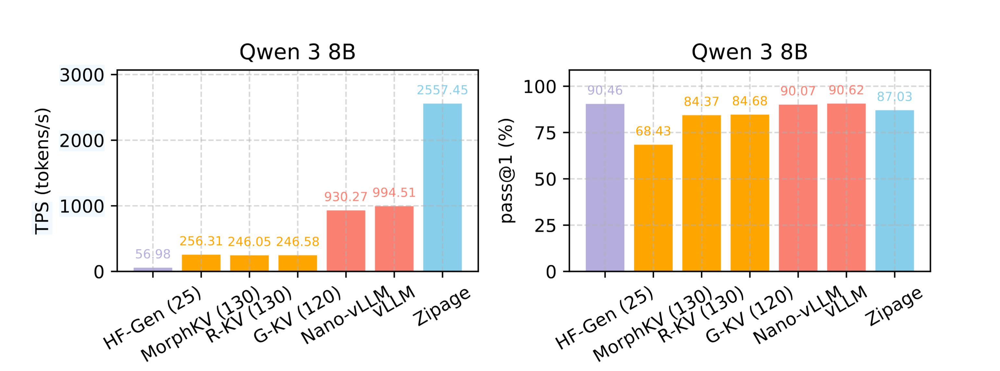

<p align="center">

</p>


# Zipage

A high-concurrency LLM offline inference engine based on PagedAttention and KV cache compression.

## Key Features

* **High Concurrency** - This project builds on PagedAttention and supports KV cache compression. The memory required for each request remains **constant**, thereby sustaining high concurrency.
* **Optimization Suite** - Asynchronous decoding and compression, Prefix caching, Tensor Parallelism, etc.

TODO
- [ ] Online engine.
- [ ] Support chunked prefilling.
- [ ] Adaptive KV cache budget.
- [ ] More sampling algorithms.
- [ ] Support more models, including VLM.


## Experiment Overview

<p align="center">

</p>

While achieving 95% of the performance of vLLM cache, Zipage more than doubled its TPS.


## Installation

Environment

```
conda create --name zipage python=3.12
conda activate zipage

# CUDA 12.8
pip install torch==2.9.0 torchvision==0.24.0 torchaudio==2.9.0 --index-url https://download.pytorch.org/whl/cu128

pip install flash-attn --no-build-isolation
```

Install

```
git clone https://xxx.git
cd zipage
pip install -e .
```


## Quick Start


Download model

```python
from huggingface_hub import snapshot_download

snapshot_download(repo_id="Qwen/Qwen3-8B", local_dir="./models/qwen3_8b")
```

Generation

```python
from transformers import AutoTokenizer
from zipage import ZipLLM as LLM, SamplingParams


path = './models/qwen3_8b'
llm = LLM(
    path,
    gpu_memory_utilization=0.9,
    max_cache_blocks_per_seq=8,
    enable_async_compress=True,
    enable_hybrid_engine=True,
    enable_prefix_cache=True,
    use_global_score=True,
    use_similarity=True,
    lightning_similarity=True,
    enable_pooling=True
)
sampling_params = SamplingParams(temperature=0.6, max_tokens=2048)
prompts=['hello, zipage.']
outputs = llm.generate(prompts, sampling_params)
print(outputs[0]['text'])
```

## Benchmark

Inference on math benchmark (AMC 23, AIME 24, GSM8K)

```shell
bash scripts/mathbench.sh
```

Inference on LongBench

```shell
python examples/longbench_process.py
bash scripts/longbench.sh
```
## Citation

If you use Zipage for your research, please cite our paper:

```
@misc{liao2026zipagemaintainhighrequest,
      title={Zipage: Maintain High Request Concurrency for LLM Reasoning through Compressed PagedAttention}, 
      author={Mengqi Liao and Lu Wang and Chaoyun Zhang and Bo Qiao and Si Qin and Qingwei Lin and Saravan Rajmohan and Dongmei Zhang and Huaiyu Wan},
      year={2026},
      eprint={2603.08743},
      archivePrefix={arXiv},
      primaryClass={cs.DC},
      url={https://arxiv.org/abs/2603.08743}, 
}
```

## Acknowledgements

This project was developed with reference to [Nano-vLLM](https://github.com/GeeeekExplorer/nano-vllm). We appreciate the ideas and implementation patterns it provides, which helped inform parts of our design and engineering decisions.

Thanks to the Nano-vLLM authors and contributors for open-sourcing and maintaining the project.
